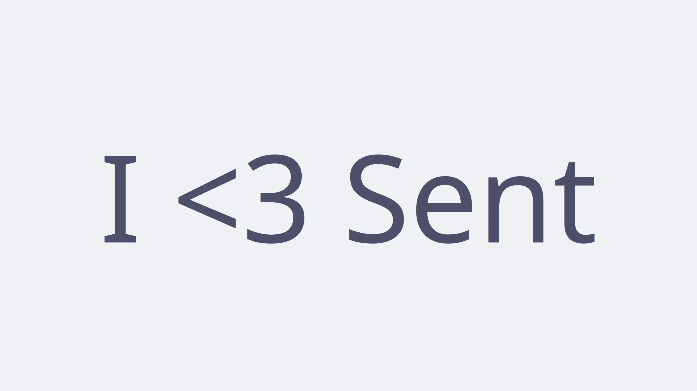
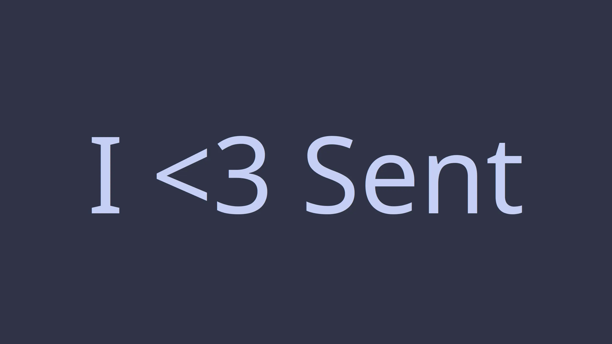
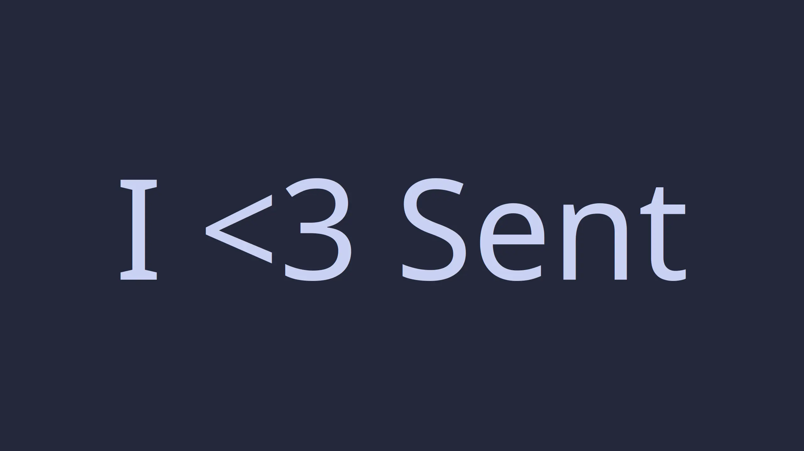
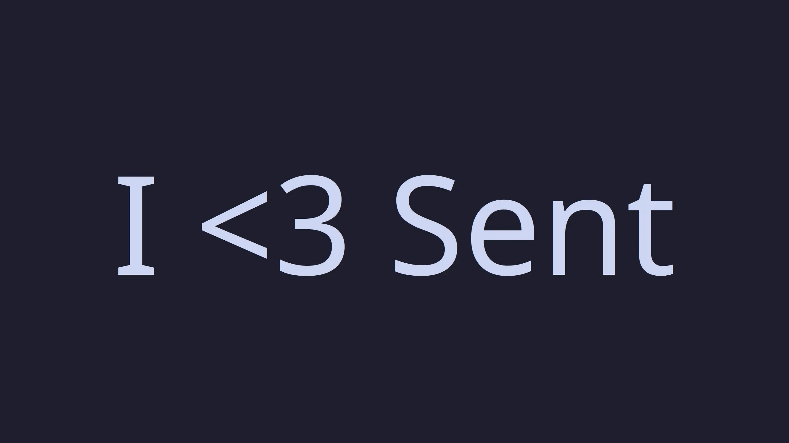

<h3 align="center">
	<br/>
	
	Catppuccin for <a href="https://tools.suckless.org/sent/">sent</a>
	
</h3>

<p align="center">
	<a href="https://github.com/xzi/sent/stargazers"></a>
	<a href="https://github.com/xzi/sent/issues"></a>
	<a href="https://github.com/xzi/sent/contributors"></a>
</p>

<p align="center">
	
</p>

## Previews

<details>
<summary>🌻 Latte</summary>

</details>
<details>
<summary>🪴 Frappé</summary>

</details>
<details>
<summary>🌺 Macchiato</summary>

</details>
<details>
<summary>🌿 Mocha</summary>

</details>

## Usage

1. Download the patch file for the colorscheme you want from the patches folder
2. Copy the patch to your sent source folder
3. Run `git apply colorscheme.patch` (replace colorscheme with the colorscheme's name)
4. Delete config.h
5. Rebuild

<!-- this section is optional -->
## 🙋 FAQ

-	Q: **_"I'm getting an error about the patch failing."_**\
	A: Open `config.def.h` and make sure the following is set.
	```
	static const char *colors[] = {
          "#4c4f69", /* foreground color */
          "#eff1f5", /* background color */
 	};
 	```

## 💝 Thanks to

- [xzi](https://github.com/xzi)

&nbsp;

<p align="center">
	
</p>

<p align="center">
	Copyright &copy; 2021-present <a href="https://github.com/catppuccin" target="_blank">Catppuccin Org</a>
</p>

<p align="center">
	<a href="https://github.com/catppuccin/catppuccin/blob/main/LICENSE"></a>
</p>
